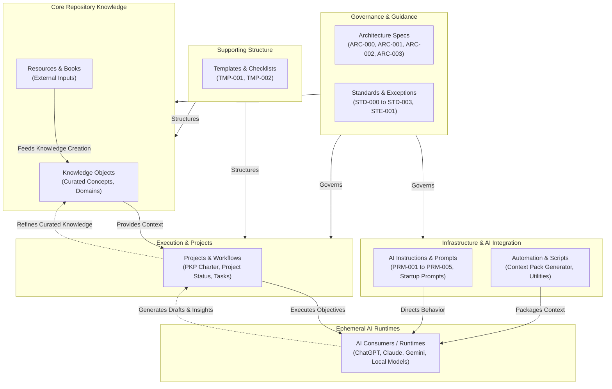
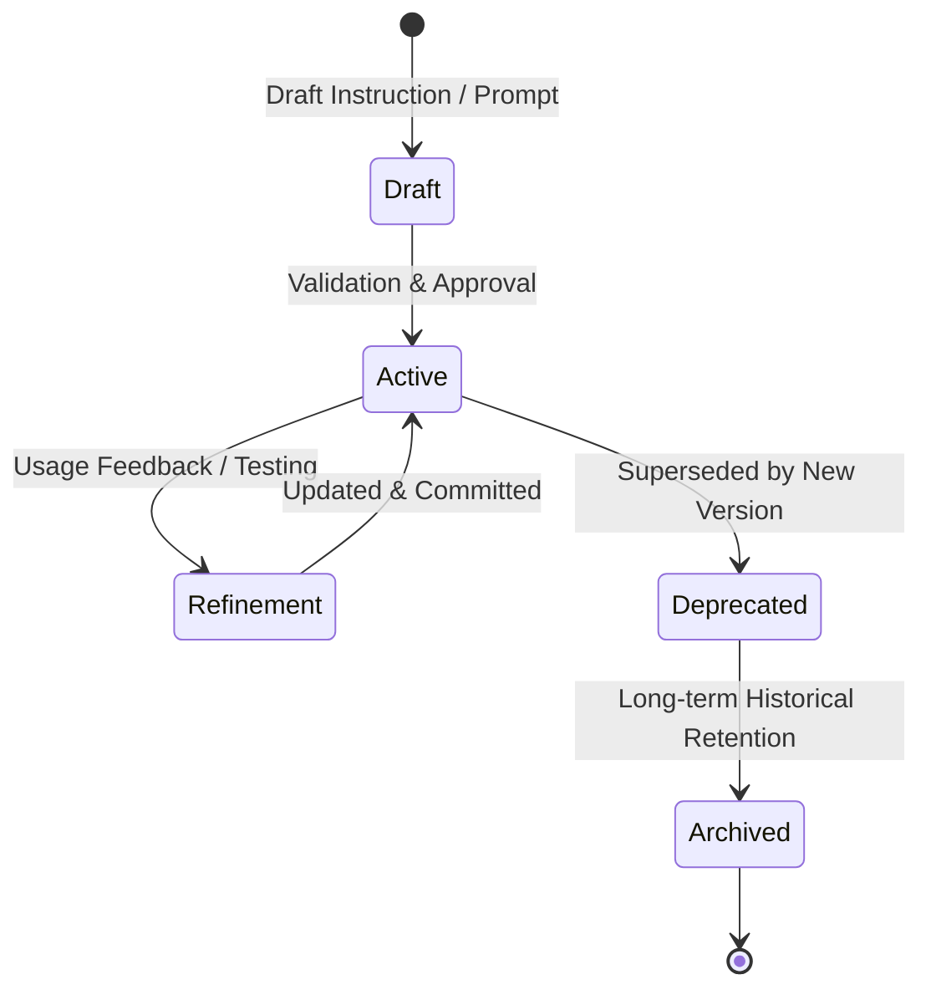

# ARC-003 - AI Instruction Architecture

**Status:** Active

**Version:** 1.0

**Owner:** Personal Knowledge Platform (PKP)

**Location:** `Architecture/ARC-003 - AI Instruction Architecture.md`

**Last Updated:** 02-AUG-2026

---

## Purpose

This document defines the **AI Instruction Architecture** for the Personal Knowledge Platform (PKP). It establishes the structural taxonomy, operational scopes, governance principles, lifecycle models, and runtime delivery boundaries governing all instruction assets utilized across AI interaction channels.

AI instructions constitute a critical sub-category of the broader **AI Assets** managed within the platform. While the PKP will over time incorporate additional AI asset classes (such as Context Packs, tool integration definitions, model configurations, and evaluation datasets), this specification strictly governs the architectural boundaries, classification, and management of **instructional artifacts and prompt systems**. Other AI asset categories may be governed by dedicated future architecture documents.

---

## Scope

This architecture governs all textual guidance, system prompts, role profiles, workflow instructions, and prompt templates designed to direct AI behavior within the PKP ecosystem.

### In Scope

* **System Instructions:** Fundamental behavior, identity, and safety guardrails.
* **Startup Instructions:** Session initialization and startup prompt sequences.
* **Context Instructions:** Domain-specific and notebook knowledge bases.
* **Project Instructions:** Project-bound objectives, constraints, and progress tracking prompts.
* **Assistant Profiles & Mentors:** Persona-based instructions (e.g., mentors, coaches, specialized technical advisors).
* **Workflow Instructions:** Multi-step procedural and checklist guidance.
* **Task Instructions:** Discrete, single-purpose operational prompts (e.g., prompt-driven knowledge extraction).
* **Instruction Templates:** Standardized structural formats used to construct new instruction sets.

### Out of Scope

This document does not define the architecture or specification for:

* **Context Packs:** Generated logical knowledge bundles (e.g., PKP-Core, Learning).
* **Transport Packages:** Physical delivery representations (Flat Packages, Zip Packages).
* **Model Context Protocol (MCP):** Server configurations, tool definitions, and JSON schemas.
* **Model Configurations:** Local or cloud AI model parameters, quantization settings, or Modelfiles.
* **Evaluation Assets:** AI benchmark datasets, test cases, and automated validation scripts.
* **Runtime-Specific Configurations:** Platform-native JSON/YAML application settings (e.g., Open WebUI or Obsidian plugin configurations).

*Note: These excluded categories represent separate AI asset domains and may be governed by future architecture specifications (e.g., `ARC-004 - AI Transport Architecture` or `ARC-005 - AI Integration & Tooling Architecture`).*

---

## Architectural Principles

The AI Instruction Architecture is guided by the following core principles:

1. **Repository First:** All authoritative AI instructions reside natively within the PKP Git repository. External AI platforms consume instructions but never become the canonical source of truth. *(Note: File-naming exceptions governing control files or markers are registered in [[STE-001 - Repository Naming Exceptions]].)*
2. **Single Source of Truth:** Every instruction set exists in exactly one canonical repository location to prevent content duplication and divergence.
3. **Platform Agnostic & Vendor Independent:** Instructions are designed using open Markdown standards. They avoid proprietary platform syntax and remain usable across diverse AI environments (e.g., ChatGPT, Claude, Gemini, NotebookLM, Open WebUI, Ollama).
4. **Human Governed:** AI systems operate as reasoning collaborators. Final authority over instruction creation, modification, and retirement remains strictly with the human owner.
5. **Version Controlled:** All changes to instruction logic, constraints, and personas are tracked via Git version history.
6. **Markdown First:** Instructions follow standard Markdown specifications (`STD-002`) to ensure human readability, clean parsing by LLMs, and long-term portability.
7. **Consumers, Not Owners:** AI platforms are ephemeral consumers of instructions. Instructions direct AI behavior during runtime but do not transfer repository ownership to the AI platform.
8. **Separation of Repository and Runtime:** The repository represents the permanent, local system of record. AI runtime environments (chats, context windows, API sessions) are volatile execution targets. Instructions bridge the repository and runtime without coupling the repository structure to platform limitations.

---

## AI Instruction Taxonomy

AI instructions within the PKP are classified according to their operational scope, lifetime, and functional responsibility rather than their storage medium.

To ensure strict compliance with `STD-001` (Naming Standard), **`PRM-` is the sole managed document file prefix** authorized for AI instruction and prompt artifacts stored in the repository. Category codes such as `SYS` represent logical functional classifications only and are **not** repository file naming prefixes.

| Category | Logical Classification | Repository Prefix | Scope / Responsibility | Primary Target / Use Case |
| --- | --- | --- | --- | --- |
| **System & Startup** | `SYS` | `PRM-` | Establishes baseline assistant persona, core governance standards, and session entry points. | Platform System Prompts, Session Startup Prompts |
| **Mentor & Coach** | `MTR` | `PRM-` | Defines domain-specific teaching personas, interaction styles, and educational workflows. | Lexicon Mentor, Smart Home Engineering Mentor |
| **Notebook & Context** | `CTX` | `PRM-` | Provides contextual grounding and specialized instructions for multi-document knowledge bases. | NotebookLM, RAG System Instructions |
| **Workflow & Checklist** | `WFK` | `PRM-` / `TMP-` | Directs multi-stage processing, quality reviews, or resource transformation procedures. | Resource Processing Checklist, Audit Workflows |
| **Task & Prompt** | `TSK` | `PRM-` | Governs discrete, single-purpose operations with structured inputs and outputs. | Knowledge Document Generator, Concept Explainer |

---

## Architecture Ecosystem & Responsibility Boundaries

The following diagram illustrates how AI instructions fit into the broader PKP architecture. Components represent distinct architectural responsibilities as defined by `ARC-002`, rather than fixed folder structures or linear workflows.

### Architectural Component Responsibilities

* **Governance & Guidance (Architecture, Standards):** Authoritative rules defining how knowledge is structured, how documents are written, and how AI collaboration is conducted.
* **Supporting Structure (Templates):** Independent structural assets that ensure document consistency across the platform.
* **Core Repository Knowledge (Knowledge & Resources):** Permanent knowledge base. Resources provide external inputs; Knowledge Objects represent curated internal understanding.
* **Infrastructure & AI Integration (Instructions & Automation):** Tools and instructional assets stored in the repository's canonical AI instruction area (as defined by `ARC-002`) that enable seamless AI interaction and automated context transport.
* **Implementation (Projects):** Active initiatives, charters, and progress reports that consume Governance, Knowledge, and Infrastructure to execute objectives.
* **Ephemeral AI Runtimes:** External or local AI models that consume generated packages and instructions to assist the human owner without persisting state outside the repository.

---

## AI Instruction Lifecycle

The lifecycle defined below applies strictly to **AI Instruction Assets**. *(Note: Repository-wide governance lifecycles for general knowledge objects reside in `ARC-002 - Repository Architecture` to maintain single-responsibility separation across architecture specifications).*

### Lifecycle States

1. **Draft:** Initial creation of an instruction set or prompt. Kept in working areas or feature branches until validated.
2. **Active:** Fully validated, compliant with `STD-001` and `STD-004`, committed to the canonical repository AI instruction area, and approved for production use.
3. **Refinement:** Iterative updating based on model performance, new platform capabilities, or edge-case handling. Changes must be tested against sample inputs before returning to Active status.
4. **Deprecated:** Instruction set is superseded by a superior prompt pattern or architectural change. Kept temporarily for backward compatibility.
5. **Archived:** Historical record retained in Git version control but inactive in production workflows.

---

## Related Documents

The following canonical repository documents relate directly to this architecture specification:

* [[README]]
* [[PKP-000 - Project Charter]]
* [[PKP-001 - AI Collaboration Guide]]
* [[ARC-000 - PKP Architecture Overview]]
* [[ARC-001 - Knowledge Architecture]]
* [[ARC-002 - Repository Architecture]]
* [[STD-000 - AI Collaboration Standard]]
* [[STD-001 - Naming Standard]]
* [[STD-002 - Markdown Writing Standard]]
* [[STD-003 - Repository Marker Standard]]
* [[STE-001 - Repository Naming Exceptions]]

---

## Document Summary & Audit Trail

| Date | Version | Summary of Changes | Author |
| --- | --- | --- | --- |
| **02-AUG-2026** | **1.0** | Published canonical AI Instruction Architecture specification. Bounded scope strictly to AI instructions while preserving future expansion paths for AI assets. Established instruction taxonomy, runtime boundaries, and lifecycle states. Incorporated EA Review findings: clarified `SYS` as logical classification vs `PRM-` as sole physical file prefix; separated Templates from Governance in Mermaid diagrams per `ARC-002`; normalized Related Document links to Obsidian `[[Wiki-Links]]` (`STD-002`); and referenced canonical repository responsibilities (`STE-001`, `ARC-002`). | Personal Knowledge Platform (PKP) |